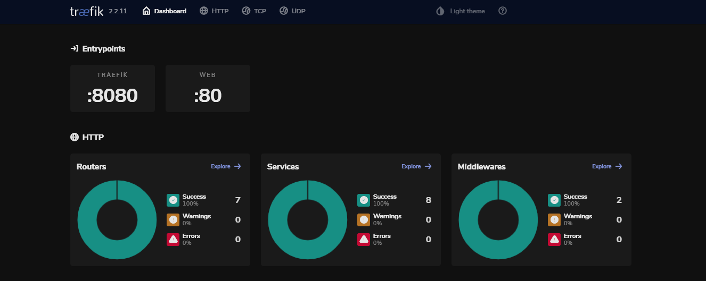
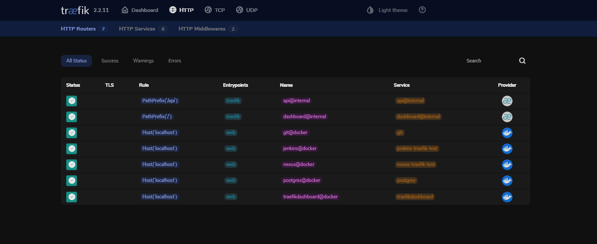
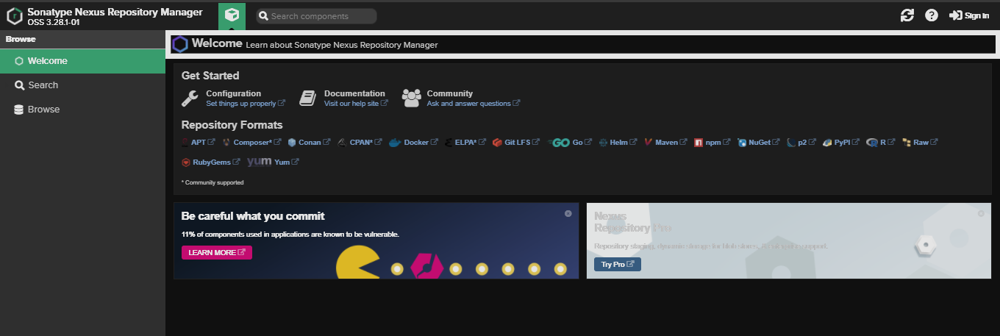
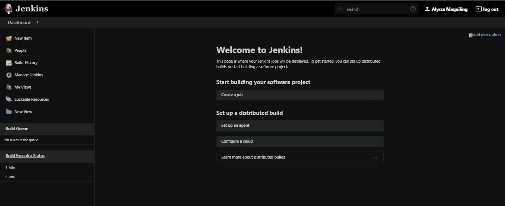
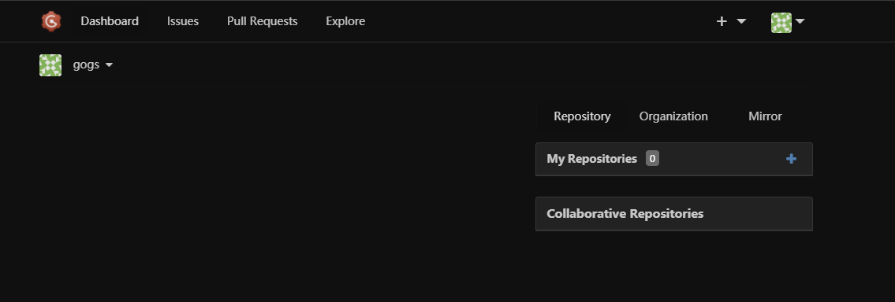

# CI/CD pipeline with Docker Compose

Runs containers for Traefik, Jenkins, Nexus Repository, Gogs (self-hosted Git service) and PostgreSQL (dependency for Gogs)

To deploy containers locally, run `./start.sh`

## Screenshots

### Traefik at traefik.localhost

### Nexus Repository at nexus.localhost

### Jenkins at jenkins.localhost

### Gogs at git.localhost

